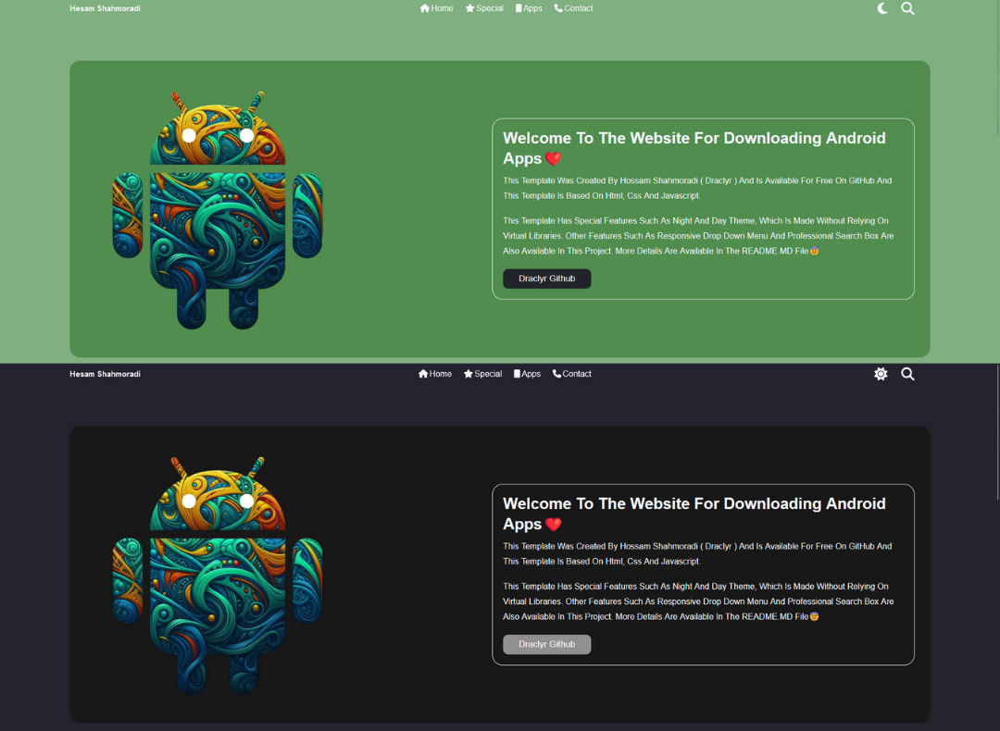
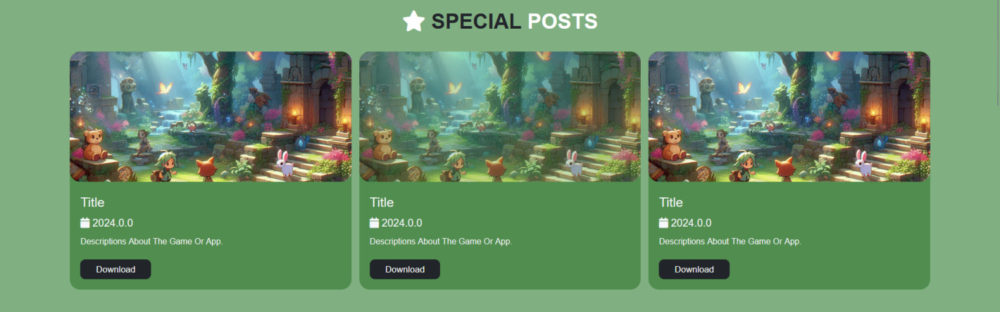
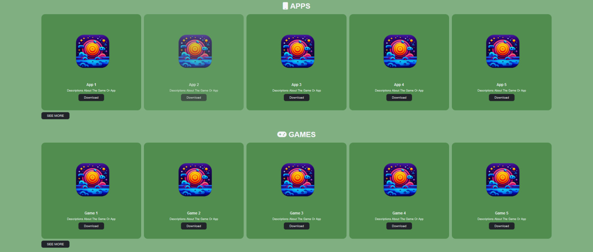
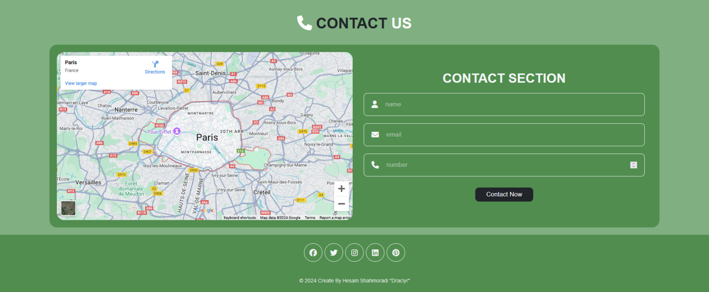

# About Ronic

<h2 text-align="center">
🔥In this form of html, css, javascript languages
It is used and has optimal and functional codes, but this template is not connected to any virtual library and all the styles are written by myself , This template has a day and night theme. Professional search box and drop down menu are also available in this template😎</h2>

A view of the main part of the template:

</a>

This is a website for downloading Android apps. For the first part of the applications, I put a special part so that you can put important applications in that part😏:

</a>

The next section shows the latest Android apps and games you have uploaded on the website, which is very useful:

</a>

In this section, users can contact you for any problem, and the footer section has a simple but practical design😇

</a>

And finally, I will be very happy if you rate the project❤️

